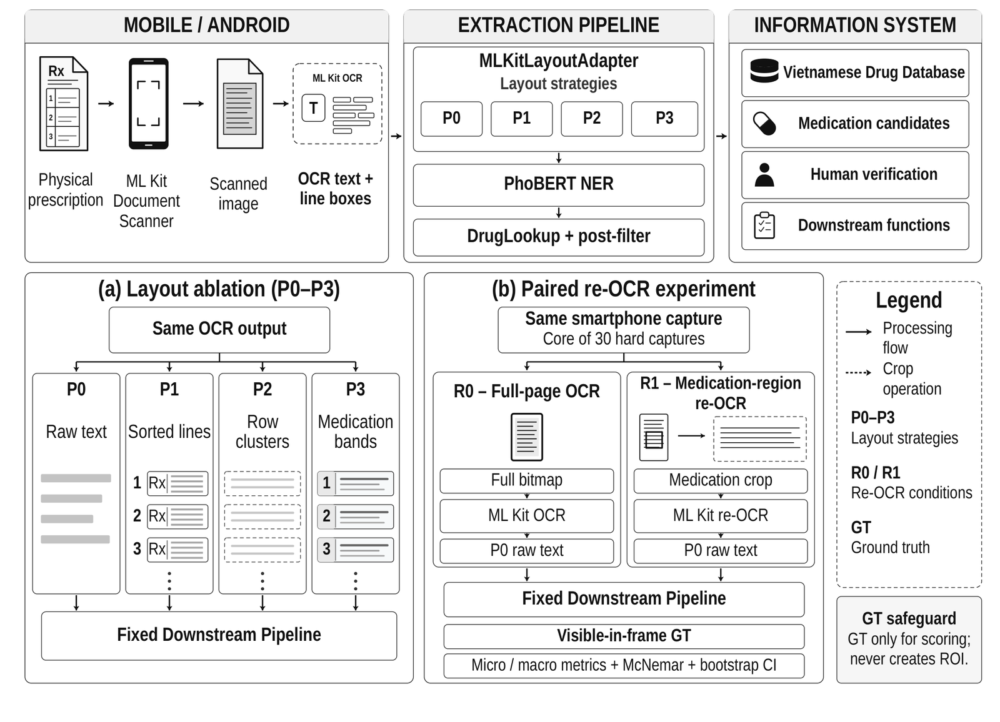
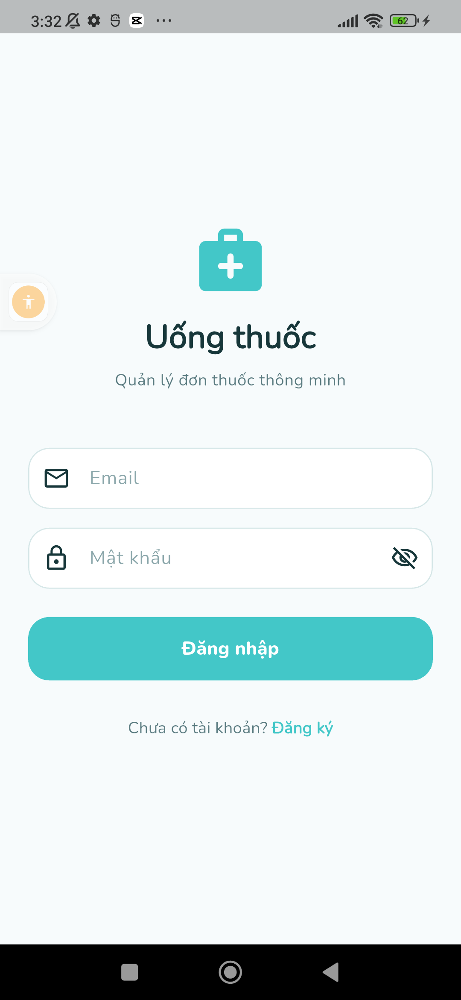
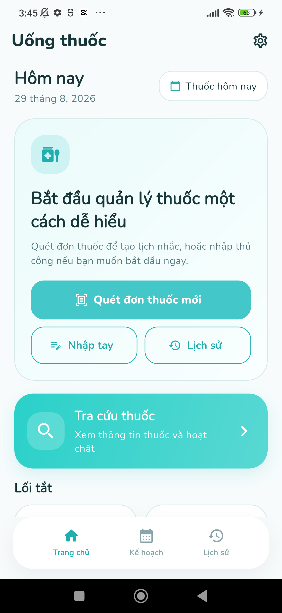
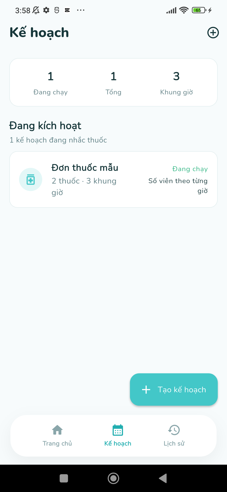
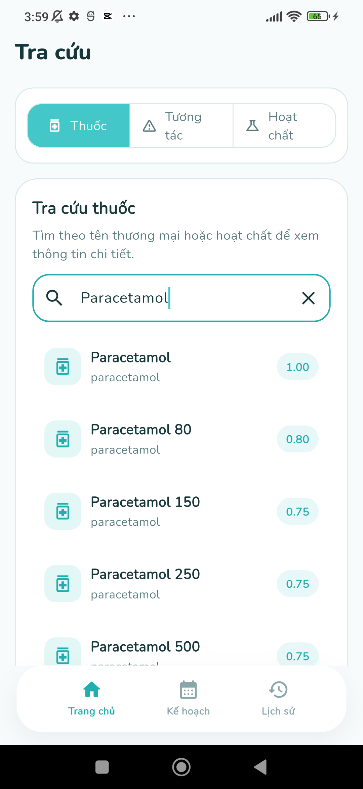
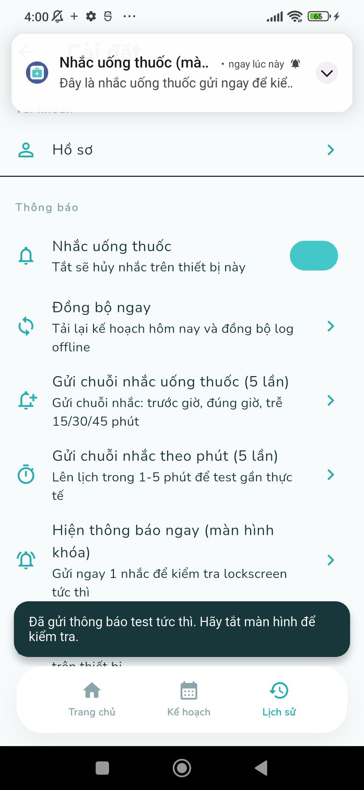
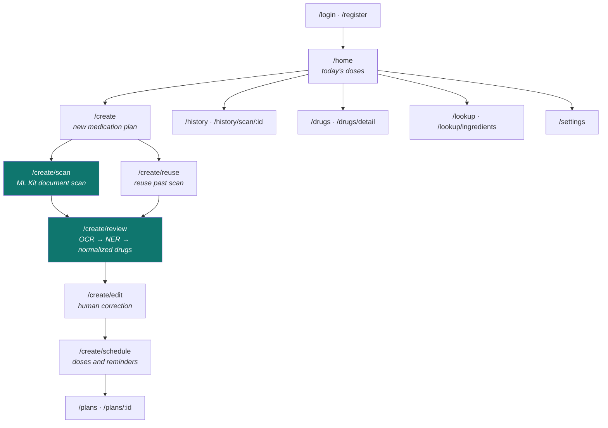

<div align="center">
  
  <h1>MedicineApp</h1>
  <p><strong>Extracting medication information from Vietnamese prescriptions on a smartphone.</strong><br>
  Public research artifact for the ISBM 2026 paper.</p>

  [](LICENSE)
  [](#project-overview)
  [](#prerequisites)
  [](#the-application)
  [](REPRODUCIBILITY.md)

  <p>
    <a href="#what-you-can-run">What you can run</a> ·
    <a href="#from-the-paper-to-the-code">Paper → code</a> ·
    <a href="#rebuilding-the-project-from-scratch">Rebuild from scratch</a> ·
    <a href="#installing-and-running-the-application">Run the app</a> ·
    <a href="REPRODUCIBILITY.md">Reproducibility contract</a>
  </p>
</div>

> [!WARNING]
> MedicineApp is a research prototype, not a medical device. OCR output and
> extracted medication information require human verification and must not be
> used as the sole basis for diagnosis, prescribing, dispensing, or dosing.

---

## Project overview

MedicineApp studies an **edge–cloud workflow** for extracting medication information from Vietnamese prescriptions photographed with a smartphone. The Flutter client performs document acquisition and on-device Google ML Kit OCR; the resulting OCR observations are then passed through layout reconstruction, a **frozen** PhoBERT named-entity-recognition model, and a Vietnamese drug-name normalization layer.

This repository accompanies the paper:

> **A Mobile Information System for Drug Extraction from Vietnamese Prescriptions: OCR Layout Ablation and Text-Anchored ROI Re-OCR under Challenging Smartphone Conditions** — ISBM 2026, Springer LNNS.

The study holds the downstream model fixed and varies exactly one stage at a time, so that any measured change can be attributed to that stage. Two experiments follow from this design:

- **RQ1 — layout representation.** Four ways of serializing the same ML Kit OCR output (`P0` raw lines, `P1` sorted lines, `P2` row clusters, `P3` medication bands) are compared under an identical downstream pipeline.
- **RQ2 — ROI intervention.** Full-page OCR (`R0`) is compared against text-anchored medication-region re-OCR (`R1`) on the *same* paired smartphone captures.

Readers arriving from the paper should begin with [**From the paper to the code**](#from-the-paper-to-the-code), which links every claim to the file that implements it.

<p align="center"></p>

**Figure 1 — system architecture and controlled experimental design** (reproduced from the paper). *Top:* the mobile pipeline scans a prescription on-device and passes ML Kit OCR text through the fixed extraction pipeline into the information system. *Bottom:* the two controlled comparisons this repository implements — (a) the P0–P3 layout ablation (RQ1) and (b) the paired R0/R1 re-OCR experiment (RQ2) — sharing the same fixed downstream pipeline and scored only against ground truth, never using it to localize the ROI.

---

## From the paper to the code

Each experimental claim in the paper corresponds to a specific file in this repository.

### Pipeline stages

| Paper concept | Implementation | Notes |
| :-- | :-- | :-- |
| OCR layout representations **P0–P3** | [`core/classify/mlkit_layout_adapter.py`](core/classify/mlkit_layout_adapter.py) → `MLKitLayoutAdapter.process(strategy=...)` | Strategy keys are `p0_raw_text`, `p1_sorted_lines`, `p2_row_clusters`, `p3_medication_bands` |
| P2 row clustering (vertical overlap + center distance) | [`core/classify/mlkit_layout_adapter.py`](core/classify/mlkit_layout_adapter.py) → `MLKitLayoutAdapter.cluster_rows()` | |
| P3 serial-number-anchored medication bands | [`core/classify/mlkit_layout_adapter.py`](core/classify/mlkit_layout_adapter.py) → `MLKitLayoutAdapter.group_medication_bands()` | Falls back to P2 when no anchor is found |
| Frozen PhoBERT medication NER | [`core/classify/ner_extractor.py`](core/classify/ner_extractor.py) | `vinai/phobert-base-v2`; `underthesea` word segmentation |
| Drug-name normalization (`DrugLookup`) | [`core/drug_search/drug_lookup.py`](core/drug_search/drug_lookup.py) | RapidFuzz token-set / partial-ratio, `MIN_SCORE = 65` |
| Downstream post-filter | [`core/classify/post_filter.py`](core/classify/post_filter.py), [`core/classify/ai_semantic_filter.py`](core/classify/ai_semantic_filter.py) | |
| End-to-end orchestration | [`core/pipeline.py`](core/pipeline.py) → `MedicinePipeline.scan_prescription_app()` | The single fixed path used by every condition |
| On-device document scan + ML Kit OCR | [`PrescriptionDocumentScannerBridge.kt`](mobile/android/app/src/main/kotlin/com/medicineapp/medicine_app/PrescriptionDocumentScannerBridge.kt), [`ml_kit_prescription_image_acquirer.dart`](mobile/lib/features/create_plan/data/ml_kit_prescription_image_acquirer.dart) | `google_mlkit_text_recognition 0.15.0`, Latin recognizer |

### Experiments, tables, and figures

| Paper artifact | Script that produces it | Published output |
| :-- | :-- | :-- |
| RQ1 — P0–P3 ablation table | [`scripts/benchmark_real_mlkit_layout.py`](scripts/benchmark_real_mlkit_layout.py) | [`reports/real_layout_ablation/summary.csv`](reports/real_layout_ablation/summary.csv) |
| RQ1 — failure taxonomy | same script, `classify_failure_cascade()` | [`reports/real_layout_ablation/failure_taxonomy.csv`](reports/real_layout_ablation/failure_taxonomy.csv) |
| RQ2 — R0 vs R1 metrics (figure + table) | [`scripts/benchmark_real_medication_roi.py`](scripts/benchmark_real_medication_roi.py) | [`reports/real_medication_roi_ablation/summary.csv`](reports/real_medication_roi_ablation/summary.csv) |
| RQ2 — paired transition table (95 / 14 / 9 / 19) | same script | [`paired_transition_matrix.csv`](reports/real_medication_roi_ablation/paired_transition_matrix.csv) |
| Exact McNemar test and bootstrap intervals | same script, `--bootstrap 10000` | [`statistical_significance.json`](reports/real_medication_roi_ablation/statistical_significance.json) |
| Visible-in-frame ground-truth protocol | [`scripts/audit_visible_gt.py`](scripts/audit_visible_gt.py) | [`methods_and_annotation_protocol.md`](reports/real_medication_roi_ablation/methods_and_annotation_protocol.md) |
| On-device R0/R1 OCR collection | [`scripts/run_real_roi_phone_ocr.py`](scripts/run_real_roi_phone_ocr.py) | — (requires a connected device) |
| Consistency check of all published numbers | [`scripts/verify_published_results.py`](scripts/verify_published_results.py) | Run by `./reproduce.sh` |

---

## What you can run

The prescription images, ground truth, model checkpoint, and provider drug catalog are deliberately withheld, so how far a reader can go depends on what they can supply. The levels below are cumulative; choose one before installing anything.

| Level | What you need | What you get | Availability |
| :-- | :-- | :-- | :-- |
| **0 — Read** | Nothing | Full source of the mobile app, both backends, the pipeline, and all benchmark code | Public |
| **1 — Verify results** | Python 3 only (no dependencies) | `./reproduce.sh` re-checks every published number: the P0–P3 table, R0/R1 metrics, the `95+14+9+19=137` transition sum, the exact McNemar p-value, and the stored bootstrap intervals | Public |
| **2 — Build & test the app** | Flutter + Android SDK | `flutter analyze`, `flutter test` (unit, widget, and golden tests), and a debug build of the full UI on an emulator or device | Public |
| **3 — Run the services** | Docker + Compose | PostgreSQL, the Node.js API, and the FastAPI AI service. `docker compose up --build` brings up all three | Public |
| **4 — Make your own test prescriptions** | Python, and LibreOffice for PDF | [`tools/prescription_generator/`](tools/prescription_generator) generates synthetic Vietnamese prescriptions — fictional patients, doctors, and clinic — as JSON → DOCX → PDF, with optional medical-error injection. Print or display them and scan them from the app | Public |
| **5 — Run end-to-end extraction** | Level 3 plus a PhoBERT checkpoint and a drug catalog | The complete scan → OCR → NER → normalization → review flow. Without these two resources the extraction and drug-lookup stages return empty results | Requires the controlled archive |
| **6 — Re-execute the paper experiments** | Level 5 plus the authorized OCR observations and ground truth | Exact reproduction of the RQ1 and RQ2 numbers | On request — see [Data and model availability](#data-and-model-availability) |

> **Level 4 removes the usual barrier to trying a clinical-data project.** Generated prescriptions are printed or displayed and then scanned by the app, which exercises the genuine capture, cropping, and on-device OCR path. Only the two data-dependent stages, NER extraction and drug lookup, wait on Level 5.

### Quick verification (30 seconds, no dependencies)

```bash
git clone https://github.com/mekonglab-vn/medicineapp-isbm-2026.git
cd medicineapp-isbm-2026
./reproduce.sh
```

Expected output:

```text
PASS: aggregate RQ1/RQ2 results and public-artifact boundary are consistent
OK
```

This validates the published result tables, the transition arithmetic, the exact paired p-value, and the stored confidence intervals, and asserts that no restricted artifact class has leaked into the repository. It does **not** run ML Kit OCR or PhoBERT inference.

---

## The application

The Flutter client covers the full workflow: 18 screens across 20 routes, Riverpod state management, `go_router` navigation, and an Android platform bridge to the ML Kit document scanner. Building it and running its test suite require **no private data**, which is Level 2 above.

<p align="center">
  
  &nbsp;
  
  &nbsp;
  
  &nbsp;
  
  &nbsp;
  
</p>
<p align="center"><em>Running on a physical Android device: login, the home dashboard, a medication plan (created directly through the app — Track A), drug lookup, and a dose-reminder notification. The lookup screen is shown after seeding a local copy of the provider drug catalog for illustration only; on Track A alone, without that catalog, it returns no matches.</em></p>

**Figure 2 — client navigation graph.** Highlighted routes are where the pipeline in Figure 1 meets the user: on-device capture, then mandatory human review of the extracted drugs.



The two highlighted steps are where this repository's research contribution lives: `/create/scan` performs the on-device OCR studied in RQ2, and `/create/review` presents the output of the P0–P3 representation and the frozen NER model for **mandatory human verification** before anything becomes a medication plan.

| Area | Screens | Source |
| :-- | :-- | :-- |
| Authentication | Login, Register | [`features/auth/presentation`](mobile/lib/features/auth/presentation) |
| Home and adherence | Today's dose timeline | [`features/home/presentation`](mobile/lib/features/home/presentation) |
| Scan and review | Create, Scan, Review, Edit drugs, Schedule, Reuse history | [`features/create_plan/presentation`](mobile/lib/features/create_plan/presentation) |
| Medication plans | Plan list, Plan detail | [`features/plan/presentation`](mobile/lib/features/plan/presentation) |
| Drug lookup | Search, Detail | [`features/drug/presentation`](mobile/lib/features/drug/presentation) |
| Interaction lookup | Interaction check, Ingredient catalog, Ingredient detail | [`features/lookup/presentation`](mobile/lib/features/lookup/presentation) |
| History and settings | Scan history, Settings | [`features/history/presentation`](mobile/lib/features/history/presentation), [`features/settings/presentation`](mobile/lib/features/settings/presentation) |

Routing is defined in [`core/router/app_router.dart`](mobile/lib/core/router/app_router.dart); reminder scheduling in [`core/notifications/notification_service.dart`](mobile/lib/core/notifications/notification_service.dart).

---

## Installing and running the application

There are two ways through this repository. **Track A** needs nothing beyond public downloads and is enough to build the app, generate test prescriptions, and read every line of the pipeline. **Track B** adds the controlled supplement and is required only to reproduce the published numbers or to run live medication extraction.

| | Track A — public | Track B — controlled |
| :-- | :-- | :-- |
| Source code, all of it | Yes | Yes |
| `./reproduce.sh` result verification | Yes | Yes |
| Build and test the Flutter client | Yes | Yes |
| Start PostgreSQL, the Node API, the AI service | Yes | Yes |
| Account sign-up, medication plans, schedules, reminders | Yes | Yes |
| Generate synthetic prescriptions to scan | Yes | Yes |
| On-device document scan and ML Kit OCR | Yes | Yes |
| **NER extraction of drug names from a scan** | No — needs the checkpoint | Yes |
| **Drug search and interaction lookup** | No — needs the drug database | Yes |
| Exact reproduction of the RQ1/RQ2 numbers | No | Yes |

Track A is the honest boundary of what public code alone can do: the client runs and the capture path works end to end, but the two data-dependent stages return empty results until you supply a checkpoint and a drug catalog. Both come from the archive described under [Track B](#track-b-with-the-controlled-supplement).

### Prerequisites

| Component | Recommended |
| :-- | :-- |
| Git | 2.40 or newer |
| Python | 3.10 – 3.12 |
| Node.js | 20 LTS |
| PostgreSQL | 16, or Docker with Compose |
| Flutter | Stable, Dart `>=3.10.4 <4.0.0` |
| Android | SDK 34/35, JDK 17, Google Play-enabled emulator or device |
| LibreOffice | Optional; only to render generated prescriptions to PDF |

---

### Track A: public code only

#### 1. Clone and configure

```bash
git clone https://github.com/mekonglab-vn/medicineapp-isbm-2026.git
cd medicineapp-isbm-2026
cp .env.example .env
```

Edit `.env` and set, at minimum, a strong `POSTGRES_PASSWORD` and `JWT_SECRET`. This file is Git-ignored; never commit it.

#### 2. Start the services

```bash
docker compose up --build
```

| Service | Address |
| :-- | :-- |
| Node.js API | `http://localhost:3000/api` |
| Python AI service | `http://localhost:8000/api` |
| PostgreSQL | `localhost:5432` |

Confirm the API is alive before moving on:

```bash
curl http://localhost:3000/api/health
```

Manual, non-Docker setup is documented in [`server-node/README.md`](server-node/README.md) and [`server/README.md`](server/README.md).

#### 3. Run the Flutter client

```bash
cd mobile
flutter pub get
flutter run --dart-define=API_BASE_URL=http://10.0.2.2:3000/api
```

`10.0.2.2` is how the Android emulator reaches the host machine. On a physical device connected over USB, forward the port instead:

```bash
adb reverse tcp:3000 tcp:3000
flutter run --dart-define=API_BASE_URL=http://127.0.0.1:3000/api
```

Static checks, which need neither the backend nor any private data:

```bash
flutter analyze
flutter test
```

#### 4. Generate prescriptions to scan

Real prescriptions are not distributed, so the repository ships a generator instead. It produces Vietnamese prescriptions with fictional patients, doctors, and clinic identity, laid out like a printed form.

```bash
cd tools/prescription_generator
pip install -r requirements.txt
python data_generator.py
python generate_prescription.py --data generated_sample_data.json \
       --output output/all_samples.docx --all
```

The DOCX is converted to PDF automatically when LibreOffice is installed. `error_injector.py` additionally produces a set carrying deliberate medical errors — 10× and 100× dose slips, wrong units, interacting pairs, contraindications — which is useful for testing review behavior rather than recognition.

Display a generated page on a second screen, or print it, then scan it from `/create/scan` in the app. The capture, cropping, and on-device OCR stages all run at this point. Extraction of drug names does not, until Track B.

#### 5. Verify the published results

```bash
./reproduce.sh
```

This requires only the Python standard library. See [What you can run](#what-you-can-run).

---

### Track B: with the controlled supplement

The frozen checkpoint, the provider drug catalog, the capture-level OCR observations, and the ground truth are held in a separate controlled archive rather than in this repository. It contains prescription-derived records from real patients, so it is released on request to identified researchers who accept its handling conditions, and it carries its own `DATA_USE_NOTICE.md`.

| Path in the archive | Purpose |
| :-- | :-- |
| `models/phobert_ner_model/` | Frozen nine-label PhoBERT checkpoint used in every reported condition |
| `data/drug_db_vn_full.json` | Drug catalog for normalization and for seeding drug search |
| `authorized_inputs/rxie/` | RQ1 OCR observations, canonical ground truth, split manifests |
| `authorized_inputs/rq2/` | RQ2 paired R0/R1 OCR, visible-in-frame ground truth, verification provenance |
| `reference_results/` | Per-capture and per-instance predictions behind the published tables |

To request access, contact **phuocnguyen010204@gmail.com** or **ltdao@ctu.edu.vn**, stating the intended use. Receiving the archive is a distribution decision; it grants no license to redistribute or publish its contents.

#### 1. Place the resources

Both destinations are Git-ignored.

```text
models/phobert_ner_model/       # from the archive
data/drug_db_vn_full.json       # from the archive
```

Verify each file against the archive's `MANIFEST.sha256` before use. The checkpoint should hash to:

```text
d8e1ab2f6bc3d71480fffb6e487e5b63f36467a2d0a586585f871ce65b9d25f6
```

A checkpoint with a similar name is not necessarily the same model; check the hash rather than the filename.

#### 2. Seed the drug database

```bash
cd server-node
npm ci
npm run migrate
npm run seed:all      # drug_cache, active ingredients, interaction pairs
```

Drug search and interaction lookup in the app become populated after this step.

#### 3. Run the extraction pipeline

```bash
python3 -m venv .venv && source .venv/bin/activate
pip install -r requirements.txt
python scripts/run_pipeline.py --text $'1) ExampleDrug 500mg\n2) ExampleDrugB 10mg'
```

Restart the AI service so it picks up the checkpoint, then scan a generated prescription from the app. `/create/review` now shows recognized drug names normalized against the catalog, for human confirmation.

> Use synthetic examples when testing. Do not paste identifiable prescription text into logs, shell history, public issues, or shared terminals.

#### 4. Re-execute the paper experiments

```bash
# RQ1 — P0-P3 layout ablation
python3 scripts/benchmark_real_mlkit_layout.py \
  --rxie-root /absolute/path/to/archive/authorized_inputs/rxie \
  --output-dir /tmp/isbm-rq1-results --split val

# RQ2 — paired R0/R1 ROI re-OCR
python3 scripts/benchmark_real_medication_roi.py \
  --ocr-dir /absolute/path/to/archive/authorized_inputs/rq2/mlkit_ocr \
  --visible-gt /absolute/path/to/archive/authorized_inputs/rq2/visible_in_frame_gt.json \
  --output-dir /tmp/isbm-rq2-results --bootstrap 10000
```

Compare the output against `reference_results/` in the archive. [`REPRODUCIBILITY.md`](REPRODUCIBILITY.md) documents the input schemas, environment, seed interpretation, and the limits of what a matching result establishes.

---

### Troubleshooting

| Symptom | Cause and fix |
| :-- | :-- |
| `pip install` pulls gigabytes or fails on `paddlepaddle` | An outdated `requirements.txt`. This repository lists only the packages the code imports; re-clone or `git pull` |
| `ModuleNotFoundError: torch` from `run_pipeline.py` | Track B dependencies are not installed. `pip install -r requirements.txt` |
| Extraction returns no drugs at all | No checkpoint at `models/phobert_ner_model/`. This is expected on Track A |
| Drug search returns nothing | The catalog has not been seeded. Track B, step 2 |
| `npm test` fails at connection time | The suites in `server-node/tests/`, including those under `tests/unit/`, require a live database. `docker compose up -d postgres` first |
| The app cannot reach the API from a device | Use `adb reverse tcp:3000 tcp:3000`, and `10.0.2.2` rather than `localhost` on the emulator |
| Text in `mobile/test/.../goldens/*.png` renders as filled boxes | Expected. Golden tests run without font assets and check layout, not glyphs |

---

## Rebuilding the project from scratch

Reconstructing the system, rather than only re-checking its numbers, follows the order below. Steps 1 to 3 require no restricted resources.

**1. Generate training and test prescriptions.**
[`tools/prescription_generator/`](tools/prescription_generator) builds synthetic Vietnamese prescriptions from a medical knowledge base — patients, doctors, diagnoses, and drug lines — and renders them to DOCX and PDF in a realistic printed layout under a **fictional clinic identity**. It can also inject medical errors (10×/100× dose slips, wrong units, interacting pairs, contraindications) for robustness testing.

```bash
cd tools/prescription_generator
pip install -r requirements.txt          # python-docx
python data_generator.py                 # -> generated_sample_data.json
python append_complex_cases.py           # add multi-morbidity cases
python error_injector.py                 # -> generated_error_data.json
python generate_prescription.py --data generated_sample_data.json \
       --output output/all_samples.docx --all      # -> DOCX + PDF
```

**2. Prepare an NER dataset.**
[`scripts/prepare_ner_data.py`](scripts/prepare_ner_data.py) converts prescription label JSON into a HuggingFace token-classification dataset with `B-DRUG` / `I-DRUG` / `O` tags and serial-number-prefix handling.

**3. Fine-tune the medication NER model.**
[`scripts/train_ner.py`](scripts/train_ner.py) fine-tunes `vinai/phobert-base-v2` for token classification and reports `seqeval` precision, recall, and F1. It runs on a single GPU or in Colab.

> **Scope of this script.** It trains a three-label scheme (`O`, `B-DRUG`, `I-DRUG`). The checkpoint frozen for the published experiments uses a nine-label scheme. This script therefore documents the training procedure and data format faithfully, but running it produces a *different* model from the one behind the reported numbers. Treat any results you obtain from it as a re-implementation.

**4. Supply a drug normalization database.**
`DrugLookup` accepts JSON or CSV keyed on brand and ingredient names. The 9,284-record catalog used in the paper is provider-controlled and is not redistributed; any compatible catalog with the same fields will work.

**5. Wire up the services and the client.**
Follow [Installing and running the application](#installing-and-running-the-application) above.

> The exact checkpoint used for the published numbers is identified by SHA-256 `d8e1ab2f6bc3d71480fffb6e487e5b63f36467a2d0a586585f871ce65b9d25f6`. A model you train yourself will not reproduce the paper's figures exactly; report it as a re-implementation, not a reproduction.

---

## Repository map

| Path | Contents |
| :-- | :-- |
| `mobile/` | Flutter UI, Android document scanner, on-device ML Kit OCR bridge, tests and safe golden images |
| `core/` | OCR layout reconstruction, PhoBERT NER adapter, filtering, drug normalization |
| `server/` | Python FastAPI AI service |
| `server-node/` | Node.js API, PostgreSQL persistence, auth, plans, interaction services |
| `scripts/` | Pipeline runner, RQ1/RQ2 benchmarks, NER data prep and training, phone OCR orchestration, public verifier |
| `tools/prescription_generator/` | Synthetic Vietnamese prescription generator with medical-error injection |
| `reports/` | Aggregate publication CSV/JSON only |
| `data/`, `models/` | Availability instructions; no data, no weights |
| `docs/` | Publication manifest, data/model boundary, compliance, supplementary artifacts |

---

## Published aggregate results

### RQ1 — OCR representation ablation (`N = 1,679` canonical drug instances)

| Strategy | Micro-precision | Micro-recall | Micro-F1 |
| :-- | --: | --: | --: |
| P0 raw lines | 89.36% | 30.02% | **44.94%** |
| P1 sorted lines | 89.36% | 30.02% | **44.94%** |
| P2 row clusters | 82.79% | 25.49% | 38.98% |
| P3 medication bands | 90.63% | 19.59% | 32.22% |

Added layout structure did not help the fixed downstream model: P3 bought a small precision gain at a large cost in recall.

### RQ2 — full page versus ROI re-OCR (`N = 137` visible drug instances)

| Condition | OCR coverage | Micro-precision | Micro-recall | Micro-F1 |
| :-- | --: | --: | --: | --: |
| R0 full-page OCR | 90.51% | 77.61% | 75.91% | 76.75% |
| R1 ROI re-OCR | 92.70% | 80.74% | 79.56% | **80.15%** |

Paired transitions: **95** correct in both, **14** recovered by R1, **9** regressed under R1, **19** incorrect in both. The exact two-sided McNemar/binomial result was **`p = 0.4049`**.

> The numerical R1 improvement must **not** be reported as established statistical superiority. This repository preserves the paper's interpretation.

---

## Data and model availability

### Included on GitHub

Application, service, and benchmark source code; the synthetic prescription generator; safe UI and golden images; aggregate CSV/JSON reports; public consistency and privacy-boundary checks; citation and reconstruction documentation.

### Excluded from GitHub

Real prescription photographs or screenshots; capture-level OCR text and bounding boxes; ground-truth medication lists and provenance records; per-capture and per-instance predictions; provider-controlled drug catalogs; VAIPE files without confirmed redistribution rights; and model checkpoints or other weights.

### Requesting the controlled resources

The excluded resources are held in a single controlled archive, `medicineapp-isbm-2026-controlled-supplement`, together with a `MANIFEST.sha256` and its own `DATA_USE_NOTICE.md`. Because it contains prescription-derived records from real patients, it is **released on request** to identified researchers who state the intended use and accept the handling conditions: restricted access, encryption at rest, no re-identification, no placement in public repositories or folders, and a defined retention rule.

Requests go to **phuocnguyen010204@gmail.com** or **ltdao@ctu.edu.vn**. Receiving the archive is a distribution decision, not a license grant, and confers no right to redistribute or publish its contents. [Track B](#track-b-with-the-controlled-supplement) describes what the archive contains and how to install it.

See [`docs/PUBLICATION_MANIFEST.md`](docs/PUBLICATION_MANIFEST.md), [`docs/DATA_AND_MODEL_AVAILABILITY.md`](docs/DATA_AND_MODEL_AVAILABILITY.md), and [`docs/SUPPLEMENTARY_ARTIFACTS.md`](docs/SUPPLEMENTARY_ARTIFACTS.md).

---

## License, copyright, and compliance

Source code and project-authored documentation are released under the [MIT License](LICENSE).

The MIT License does **not** automatically cover third-party datasets, model weights, provider drug catalogs, Google services, or package dependencies. Each retains its own terms and access rules.

When processing real prescriptions, users are responsible for consent, institutional approval, information security, and applicable privacy law, including Vietnam's [Law on Personal Data Protection No. 91/2025/QH15](https://vanban.chinhphu.vn/?classid=1&docid=214590&pageid=27160&typegroup=). Do not place identifiable medical or prescription data in GitHub, public folders, logs, screenshots, issues, or test fixtures.

Read [`docs/LEGAL_AND_COMPLIANCE.md`](docs/LEGAL_AND_COMPLIANCE.md) before using this software with non-synthetic data. That document is general project guidance, not legal or medical advice.

## Citation

Machine-readable metadata is in [`CITATION.cff`](CITATION.cff). When publishing results derived from this artifact, cite the ISBM 2026 paper and state whether the work rests on **Level 1** aggregate verification or **Level 6** full re-execution.

## Security

Do not open a public issue containing credentials, prescription data, model access links, or security-sensitive logs. Follow [`SECURITY.md`](SECURITY.md) for responsible disclosure.
