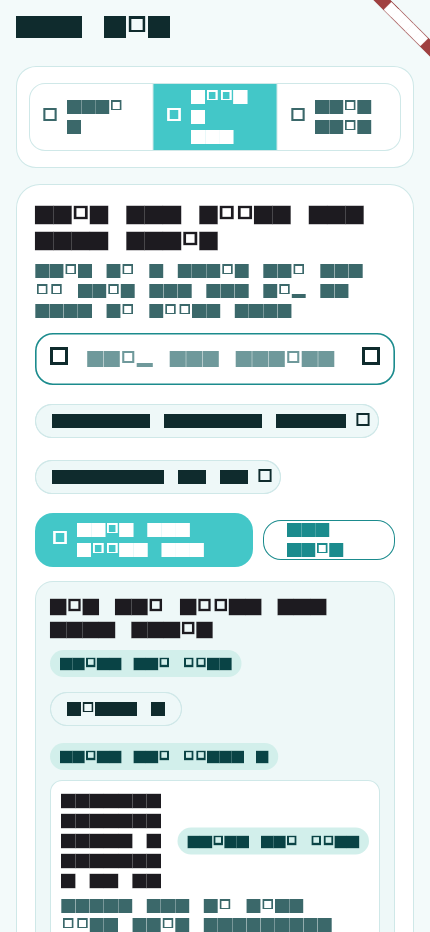
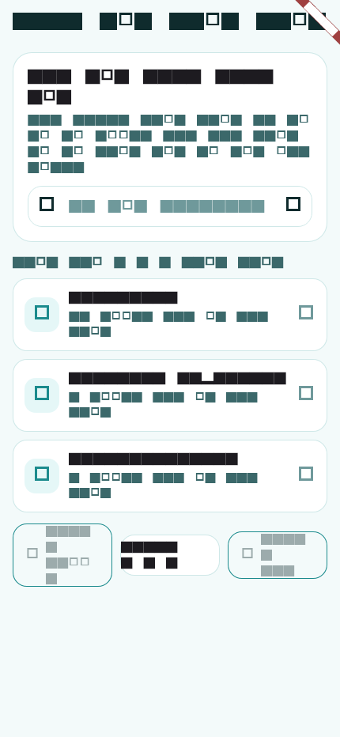
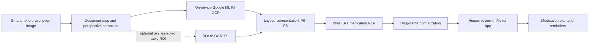

<div align="center">
  
  <h1>MedicineApp</h1>
  <p><strong>ISBM 2026 public research artifact for Vietnamese prescription OCR, medication extraction, and ROI re-OCR.</strong></p>
  <p>
    <a href="#quick-public-verification">Verify results</a> ·
    <a href="#install-and-run-the-application">Install the app</a> ·
    <a href="#reproduce-the-paper-experiments">Reproduce experiments</a> ·
    <a href="REPRODUCIBILITY.md">Reproducibility contract</a> ·
    <a href="LICENSE">MIT License</a>
  </p>
</div>

> [!WARNING]
> MedicineApp is a research prototype, not a medical device. OCR output and
> extracted medication information require human verification and must not be
> used as the sole basis for diagnosis, prescribing, dispensing, or dosing.

## Project overview

MedicineApp studies an edge–cloud workflow for extracting medication
information from Vietnamese prescriptions captured by a smartphone. The mobile
client performs document acquisition and on-device Google ML Kit OCR. Structured
OCR observations are then processed by layout reconstruction, a fixed PhoBERT
named-entity recognition model, and a Vietnamese drug-name normalization layer.

The repository accompanies the ISBM 2026 paper:

> **A Mobile Information System for Drug Extraction from Vietnamese
> Prescriptions: OCR Layout Ablation and Text-Anchored ROI Re-OCR under
> Challenging Smartphone Conditions**

The public artifact is designed for three uses:

1. inspect the Flutter application and backend implementation;
2. verify the published aggregate RQ1/RQ2 results without private data; and
3. re-execute the experiments when the user has separately authorized model,
   OCR, annotation, and normalization resources.

## Application preview

The images below are committed test/golden assets generated for the public
codebase. They contain no real prescription photographs or patient information.

<table>
  <tr>
    <td align="center"></td>
    <td align="center"></td>
  </tr>
  <tr>
    <td align="center"><sub>Medication interaction lookup</sub></td>
    <td align="center"><sub>Active ingredient catalogue</sub></td>
  </tr>
</table>

## System workflow



Core research questions:

- **RQ1 — layout representation:** compare P0 raw text, P1 sorted lines, P2 row
  clusters, and P3 medication bands under a fixed downstream pipeline.
- **RQ2 — ROI intervention:** compare R0 full-page OCR with R1 user-guided
  medication-table ROI re-OCR on paired smartphone captures.

## Repository contents

| Path | Contents |
| --- | --- |
| `mobile/` | Flutter UI, Android document scanner, on-device ML Kit OCR bridge, tests and safe golden images |
| `core/` | OCR layout reconstruction, PhoBERT NER adapter, filtering and drug normalization |
| `server/` | Python FastAPI AI service |
| `server-node/` | Node.js API, PostgreSQL persistence, authentication, plans and interaction services |
| `scripts/` | CLI runner, RQ1/RQ2 benchmarks, phone OCR orchestration and public verifier |
| `reports/` | Aggregate publication CSV/JSON only |
| `data/` | Data-availability instructions; no prescription-derived data |
| `models/` | Model-availability instructions; no weights |
| `docs/` | Publication manifest, data/model boundary, compliance and supplementary-artifact notes |

## Quick public verification

The public aggregate verifier requires only Python 3 and its standard library.

```bash
git clone https://github.com/mekonglab-vn/medicineapp-isbm-2026.git
cd medicineapp-isbm-2026
./reproduce.sh
```

Expected final messages:

```text
PASS: aggregate RQ1/RQ2 results and public-artifact boundary are consistent
OK
```

This verifies result tables, transition arithmetic, the exact paired p-value,
stored confidence intervals, and the absence of restricted artifact classes. It
does **not** run ML Kit OCR or PhoBERT inference.

Equivalent commands:

```bash
python3 scripts/verify_published_results.py
python3 -m unittest tests/test_public_artifact_consistency.py
```

## Install and run the application

### Prerequisites

| Component | Recommended environment |
| --- | --- |
| Git | 2.40 or newer |
| Python | 3.10–3.12 |
| Node.js | 20 LTS |
| PostgreSQL | 16, or Docker with Compose |
| Flutter | Stable release with Dart `>=3.10.4 <4.0.0` |
| Android | Android SDK 34/35, JDK 17, Google Play-enabled emulator or device |

### 1. Clone and configure

```bash
git clone https://github.com/mekonglab-vn/medicineapp-isbm-2026.git
cd medicineapp-isbm-2026
cp .env.example .env
```

Replace the placeholder values in `.env` with local secrets. Never commit this
file. At minimum, set a strong `POSTGRES_PASSWORD` and `JWT_SECRET`.

### 2. Prepare the controlled model and data resources

The public repository intentionally excludes the model checkpoint, provider
drug database, prescription images, OCR JSON, and ground truth. Obtain only the
resources you are authorized to use from the
[supplementary artifact folder on Google Drive](https://drive.google.com/drive/folders/12sm6zRuUiiAzQM8xxAFrLngVKZ07Kpul?usp=sharing)
or from their original licensed sources.

Expected local locations for application inference:

```text
models/phobert_ner_model/       # compatible token-classification checkpoint
data/drug_db_vn_full.json       # authorized normalization database
```

These paths are ignored by Git. The recorded SHA-256 for the frozen nine-label
PhoBERT checkpoint used in the paper is:

```text
d8e1ab2f6bc3d71480fffb6e487e5b63f36467a2d0a586585f871ce65b9d25f6
```

The Drive link is a distribution pointer, not a license grant. Access to a file
does not by itself authorize publication or redistribution. See
[`docs/SUPPLEMENTARY_ARTIFACTS.md`](docs/SUPPLEMENTARY_ARTIFACTS.md).

### 3. Start the services

Docker Compose is the simplest supported topology:

```bash
docker compose up --build
```

Default endpoints:

- Node.js API: `http://localhost:3000/api`
- Python AI service: `http://localhost:8000/api`
- PostgreSQL: `localhost:5432`

For manual service setup, see [`server-node/README.md`](server-node/README.md)
and [`server/README.md`](server/README.md).

### 4. Run the Flutter client

Android emulator:

```bash
cd mobile
flutter pub get
flutter run --dart-define=API_BASE_URL=http://10.0.2.2:3000/api
```

Physical Android device over USB:

```bash
adb reverse tcp:3000 tcp:3000
cd mobile
flutter run --dart-define=API_BASE_URL=http://127.0.0.1:3000/api
```

Mobile checks:

```bash
cd mobile
flutter analyze
flutter test
```

The Flutter UI can be inspected and tested without private prescription data.
End-to-end medication extraction additionally requires the controlled resources
from step 2.

### 5. Run the text pipeline directly

After installing Python dependencies and supplying the checkpoint/database:

```bash
python3 -m venv .venv
source .venv/bin/activate
python -m pip install --upgrade pip
python -m pip install -r requirements.txt
python scripts/run_pipeline.py --text $'1) ExampleDrug 500mg\n2) ExampleDrugB 10mg'
```

Use synthetic examples only. Do not paste identifiable prescription text into
logs, shell history, public issues, or shared terminals.

## Reproduce the paper experiments

The reproduction contract has two levels.

### Level 1 — public aggregate verification

```bash
./reproduce.sh
```

This level is complete using only the GitHub repository.

### Level 2 — authorized full re-execution

Full execution requires the frozen checkpoint, authorized OCR observations,
ground truth, and drug catalogue. Keep these resources outside Git history.

RQ1 layout ablation:

```bash
python3 scripts/benchmark_real_mlkit_layout.py \
  --rxie-root /absolute/path/to/authorized/rxie-root \
  --output-dir /tmp/isbm-rq1-results \
  --split val
```

RQ2 paired ROI re-OCR analysis:

```bash
python3 scripts/benchmark_real_medication_roi.py \
  --ocr-dir /absolute/path/to/authorized/mlkit_ocr \
  --visible-gt /absolute/path/to/authorized/visible_in_frame_gt.json \
  --output-dir /tmp/isbm-rq2-results \
  --bootstrap 10000
```

On-device R0/R1 OCR collection:

```bash
python3 scripts/run_real_roi_phone_ocr.py --help
```

See [`REPRODUCIBILITY.md`](REPRODUCIBILITY.md) for input roles, schemas,
environment details, expected outputs, seed interpretation, and claim limits.

## Published aggregate results

### RQ1 — OCR representation ablation

| Strategy | Micro precision | Micro recall | Micro F1 |
| --- | ---: | ---: | ---: |
| P0 raw lines | 89.36% | 30.02% | 44.94% |
| P1 sorted lines | 89.36% | 30.02% | 44.94% |
| P2 row clusters | 82.79% | 25.49% | 38.98% |
| P3 medication bands | 90.63% | 19.59% | 32.22% |

### RQ2 — full page versus ROI re-OCR

| Condition | OCR coverage | Precision | Recall | Micro F1 |
| --- | ---: | ---: | ---: | ---: |
| R0 full-page OCR | 90.51% | 77.61% | 75.91% | 76.75% |
| R1 ROI re-OCR | 92.70% | 80.74% | 79.56% | 80.15% |

The paired transition counts were 95 both-correct, 14 R1 recoveries, 9 R1
regressions, and 19 both-incorrect. The exact two-sided McNemar/binomial result
was `p = 0.4049`; therefore the numerical R1 increase must not be reported as
established statistical superiority.

## Public and controlled artifact boundary

### Included on GitHub

- application, service, and benchmark source code;
- safe UI/golden images;
- aggregate CSV/JSON reports;
- public consistency and privacy-boundary checks; and
- citation, availability, and reconstruction documentation.

### Excluded from GitHub

- real prescription photographs or screenshots;
- capture-level OCR text and bounding boxes;
- ground-truth medication lists and provenance records;
- per-capture/per-instance predictions;
- provider-controlled drug catalogues;
- VAIPE files without confirmed redistribution rights; and
- checkpoints and other model weights.

See [`docs/PUBLICATION_MANIFEST.md`](docs/PUBLICATION_MANIFEST.md) and
[`docs/DATA_AND_MODEL_AVAILABILITY.md`](docs/DATA_AND_MODEL_AVAILABILITY.md).

## License, copyright, and compliance

The source code and project-authored documentation are released under the
[`MIT License`](LICENSE). No registration or fee is required to apply or use the
MIT license. Copyright protection is generally automatic; voluntary copyright
registration is a separate, optional process that may help document ownership.

The MIT license does **not** automatically cover third-party datasets, model
weights, provider drug catalogues, Google services, package dependencies, or
files linked from Google Drive. Each retains its own terms and access rules.

When processing real prescriptions, users are responsible for consent,
institutional approval, information security, and applicable privacy law,
including Vietnam's [Law on Personal Data Protection No. 91/2025/QH15](https://vanban.chinhphu.vn/?classid=1&docid=214590&pageid=27160&typegroup=).
Do not place identifiable medical or prescription data in GitHub, public Drive
folders, logs, screenshots, issues, or test fixtures.

Read [`docs/LEGAL_AND_COMPLIANCE.md`](docs/LEGAL_AND_COMPLIANCE.md) before using
the software with non-synthetic data. That document is general project guidance,
not legal or medical advice.

## Citation

Machine-readable citation metadata is provided in [`CITATION.cff`](CITATION.cff).
When publishing results derived from this artifact, cite the associated ISBM
2026 paper and state whether you performed Level 1 aggregate verification or
Level 2 full re-execution.

## Security and responsible disclosure

Do not open a public issue containing credentials, prescription data, model
access links, or security-sensitive logs. Follow [`SECURITY.md`](SECURITY.md)
for responsible disclosure guidance.
